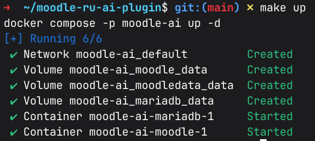
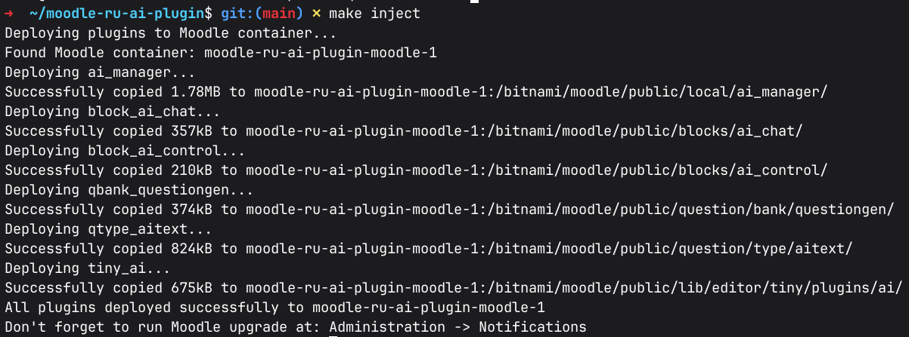
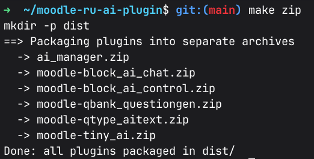
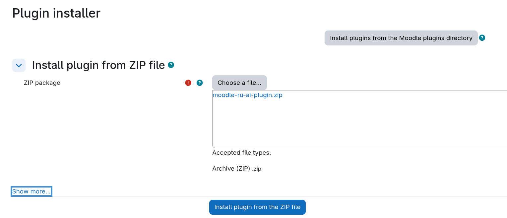
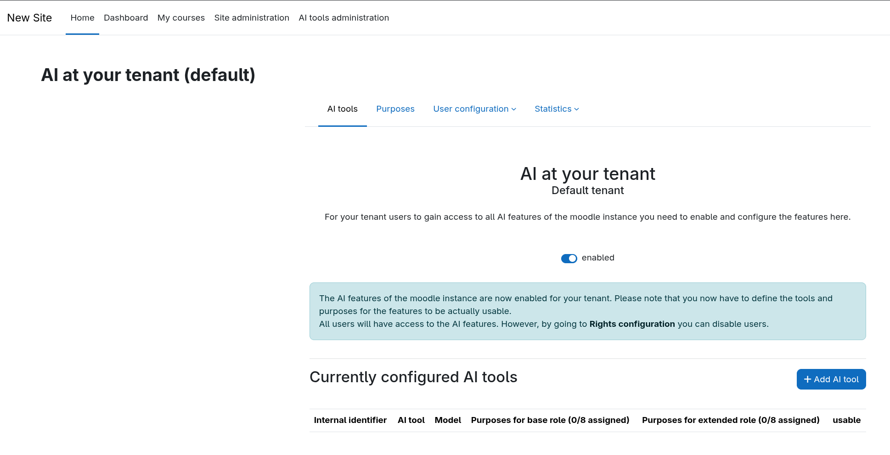
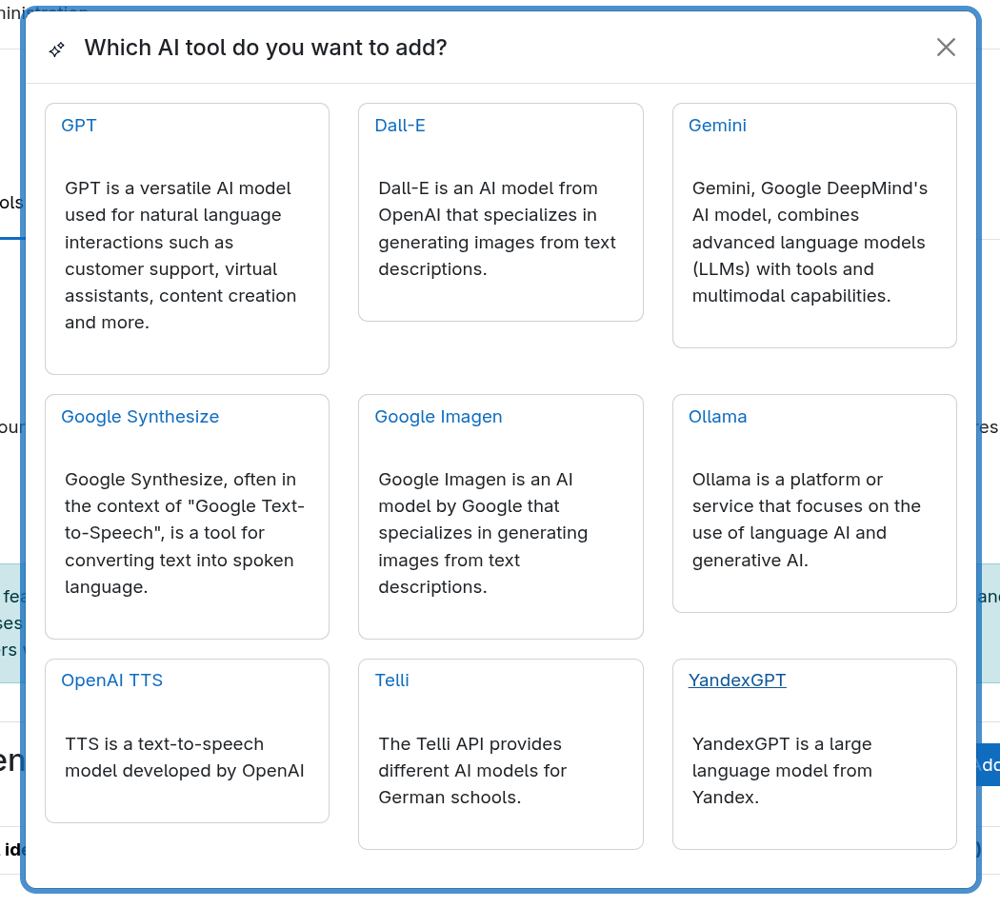
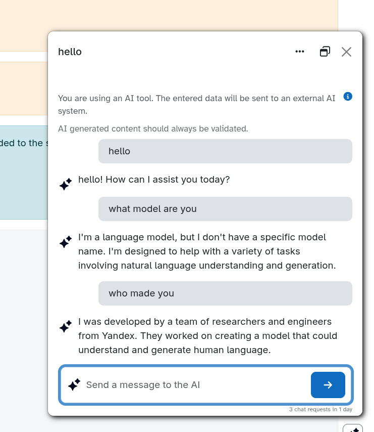

# moodle-ru-ai-plugin

Этот плагин предоставляет интеграцию YandexGPT с AI-Manager. Его можно использовать как альтернативу подсистеме AI, поставляемой с Moodle 4.5.

## Зависимости

- [Сервисный аккаунт Yandex Cloud](https://yandex.cloud/ru/docs/iam/concepts/users/service-accounts)

- [Идентификатор каталога Yandex Cloud](https://yandex.cloud/ru/docs/resource-manager/operations/folder/get-id)

- [Yandex Cloud API Key](https://yandex.cloud/ru/docs/ai-studio/operations/get-api-key)

- Docker

- Make (опционально для удобного запуска)

## Доступные цели:

```
make up          - Запустить контейнеры (detached)
make down        - Остановить и удалить контейнеры
make restart     - Перезапустить контейнеры
make clean       - Остановить и удалить контейнеры + анонимные тома
make zip         - Собрать ZIP плагинов в каталоге dist/
make clean-dist  - Удалить артефакты сборки (dist/)
make inject      - Развернуть все плагины в контейнер Moodle
```

## Быстрый старт (локально с помощью Docker)

0. **Склонируйте репозиторий с сабмодулями**

```bash
git clone --depth 1 \
    --recurse-submodules --shallow-submodules \
    https://github.com/artem-burashnikov/moodle-ru-ai-plugin.git
```

1. **Запустите окружение**

```bash
make up
```



2. **После запуска Moodle будет доступен по адресу**

- URL: http://localhost:8080
- **username**: user
- **password**: bitnami


3. **Установите плагины в контейнер с помощью команды**

```bash
make inject
```



## Установка на сервер вручную

1. **Создайте `zip-архивы` из плагинов**

```bash
make zip
```



2. **Добавьте архивы через панель администратора и следуйте указаниям помощника установки**



## Первичная найстройка для использования YandexGPT в качестве поставщика ИИ

1. **Перейдите в раздел `AI tools administration` и включите AI Tools**



2. **Добавьте YandexGPT**



3. **Внесите ваши данные из Yandex Cloud: API-ключ и ID каталога**

4. **Настройте необходимые поля**

5. **Пользуйтесь**




## Лицензия

[GNU GPL v3](LICENSE)
